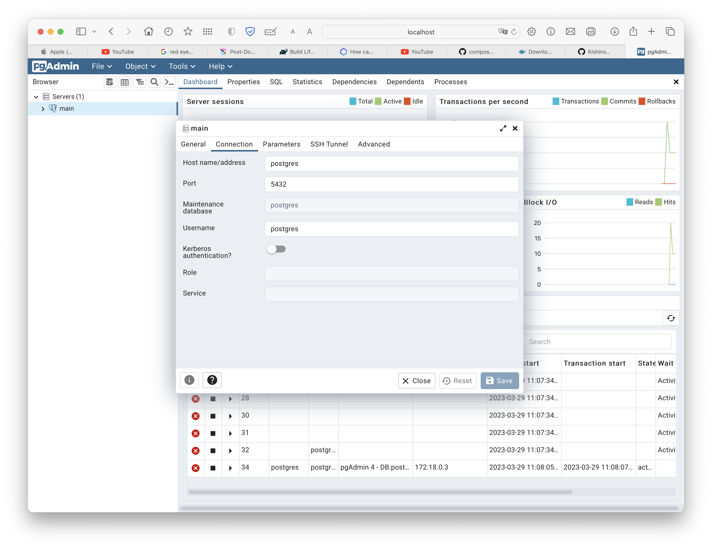

# PostgreSQL сервер  с pgAdmin

## Как запустить

1. скачать и установить Docker Desctop для MacOS [Docker-Desktop](https://www.docker.com/products/docker-desktop/)

2. скачать compose файл на диск, рекомендую положить в отдельную папку. 
[postgres-compose](https://github.com/Kishinskiy/postgres-compose)


  ```git clone https://github.com/Kishinskiy/postgres-compose.git ```

3. находясь в дирриктории с docker-compose файлом выполнить команду docker-compose up -d

параметр -d запустит контейнер в фоновом режиме, остановить контейнер можно командой docker-compose down

4. авторизоваться по адрессу http://localhost

5. при запросе пароля указать пароль который был задан в параметре PGADMIN_DEFAULT_PASSWORD  в compose файле

6. добавить новый сервер, параметры для подключения:

 * hostname/address: postgres
 * port: 5432
 * Username: postgres
 * Password: postgres



